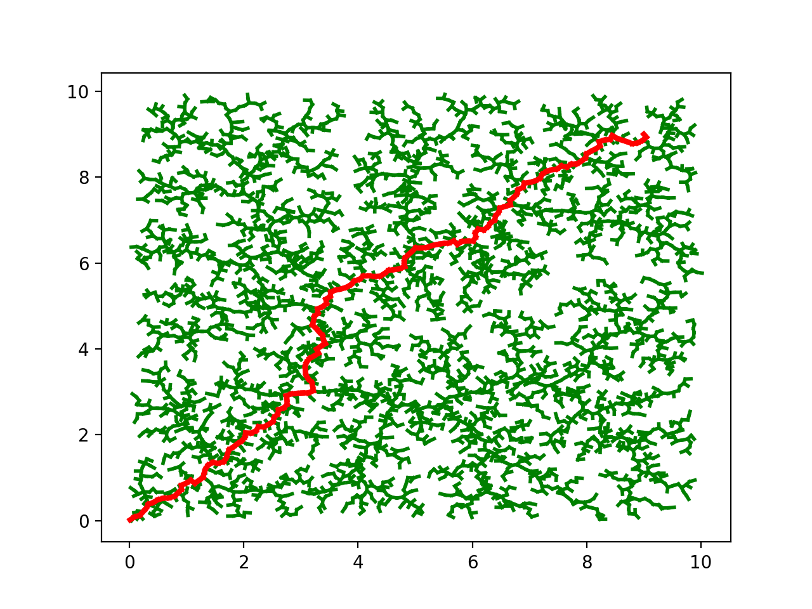
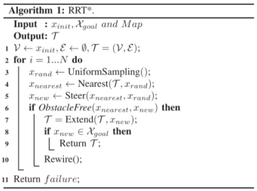

# Generic Implementation Of RRT Algorithm

This is **short** and **simple** generic implementation of the [RRT Algorithm](https://en.wikipedia.org/wiki/Rapidly-exploring_random_tree).
You can redefine any part of the code for your own purposes.

## How To Use

### Nodes

Class `NodeRRT` is defined as follows:

```python
class NodeRRT:
    def __init__(self, x, y, parentXY=None, parentNode=None):
        self.x = x
        self.y = y
        self.parentXY = parentXY
        self.parentNode = parentNode
```

Each node has to have:

- position (x and y)
- parentXY (tuple of two `int`s) will defined during the run of an algorithm
- parentNode (`NodeRRT` object) will defined during the run of an algorithm as well

### Process

1. Import `NodeRRT` class, `rrt_mpf` and `plotRRT` functions from `RRT.py` module.
```python
from RRT import NodeRRT, rrt_mpf, plotRRT
```

2. Define constants.
```python
NUMBER_OF_SAMPLES = 7000
STEP = 0.1
LAMBDA = 0.9
```

`NUMBER_OF_SAMPLES` - How many tries you are willing to make.

`STEP` - size of a RRT step.

`LAMBDA` - probability to choose your sample function over random sampling.

3. Create start node and put it inside a list. Define your goal coordinates.

```python
nodesRRT = [NodeRRT(x=0.01, y=0.02)]
x_goal, y_goal = 9, 9
```

4. Creat list of obstacles' coordinated (x's and y's separately).
```python
list_x_obstacle = []
list_y_obstacle = []
```

5. Then insert all of these inside an `rrt_mpf` function as follows:
```python
nodes, sampled_points, status = rrt_mpf(nodes=nodesRRT,
                                        number_of_samples=NUMBER_OF_SAMPLES,
                                        LAMBDA=LAMBDA,
                                        step=STEP,
                                        x_goal=x_goal,
                                        y_goal=y_goal,
                                        x_obst_list=list_x_obstacle,
                                        y_obst_list=list_y_obstacle,
                                        mapX_max=10, mapX_min=0,
                                        mapY_max=10, mapY_min=0,
                                        sample_func=sample_MPF_point,
                                        nodesAstar=[])
```

The returned values are:

- `nodes`: The list of nodes representing the tree of a solution.
You can find the path from goal to start through `parentNode`'s connections.

- `sampled_points`: Coordinates of the sampled points during the run.

- `status`: Status of a search (`success` - path found, `failure` - path not found).

## Example of a result plot:



## RRT Algorithm

The pseudocode:



### Example Of A Sampling Function

```python
def sample_MPF_point(nodesAstar, mapX_max, mapX_min, mapY_max, mapY_min):
    return sample_random_point(mapX_max, mapX_min, mapY_max, mapY_min)
```


## Credits

- [Optimal Path Planning Using Generalized Voronoi Graph and Multiple Potential Functions](https://ieeexplore.ieee.org/document/8948325)
- [Wikipedia](https://en.wikipedia.org/wiki/Rapidly-exploring_random_tree)

##

*Have fun!*

